<div align="center">

# JEPA-Spillover

### Aprendizado preditivo em espaço latente para vigilância genômica de vírus com potencial zoonótico

**Uma abordagem baseada em redes JEPA (Joint Embedding Predictive Architecture)**

[](LICENSE)
[](https://www.python.org/)
[](https://pytorch.org/)
[]()

*Subprojeto de Pós-Doutorado Júnior — PDJ/Fiocruz · Instituto Aggeu Magalhães — Fiocruz Pernambuco*

</div>

---

## Visão geral

Eventos de **transbordamento zoonótico (spillover)** estão entre as maiores ameaças à saúde pública
global. O volume de genomas virais cresce rapidamente (vigilância genômica, metagenômica ambiental,
estudos de viroma), mas a maioria dos vírus recém-identificados **não possui rótulos confiáveis de
risco zoonótico**, o que limita métodos supervisionados tradicionais.

Este projeto desenvolve uma abordagem **auto-supervisionada** baseada em **redes JEPA** para aprender
representações latentes de genomas virais, hospedeiros e contextos ecológicos, com o objetivo de
**priorizar vírus com maior potencial de spillover** antes da ocorrência de surtos.

> Em vez de reconstruir nucleotídeos ou depender exclusivamente de rótulos escassos, a JEPA aprende a
> **prever embeddings** de regiões genômicas (e de hospedeiros compatíveis) em um espaço latente
> compartilhado — capturando relações funcionais e estruturais úteis para inferir risco zoonótico.

## Por que JEPA?

| Abordagem | Limitação no contexto de spillover |
|---|---|
| Supervisionada (rótulos zoonótico/não) | Rótulos escassos, incompletos e enviesados; "não zoonótico" pode significar apenas "não estudado". |
| Generativa / reconstrução (ex.: autoencoders, MLM nucleotídeo a nucleotídeo) | Gasta capacidade modelando ruído de baixo nível em vez de semântica funcional. |
| **JEPA (predição em espaço latente)** | Aprende relações latentes entre partes dos dados **sem reconstrução literal** e com **baixa dependência de rótulos** — ideal para vírus pouco caracterizados. |

## Objetivos

**Geral:** desenvolver uma abordagem JEPA para aprender representações latentes de genomas virais,
hospedeiros e contextos ecológicos, apoiando a predição e priorização de vírus com potencial de spillover.

**Específicos (resumo):** coletar e curar genomas virais públicos; integrar metadados de hospedeiros,
taxonomia e ecologia; construir representações (k-mers, embeddings Transformer); implementar a **JEPA
genômica** e sua **extensão vírus-hospedeiro/multimodal**; avaliar embeddings (UMAP/t-SNE, clustering,
vizinhança latente); fazer **fine-tuning supervisionado** para risco de spillover; comparar com
baselines (k-mers, LSTM, Transformer supervisionado); aplicar **interpretabilidade e ablação**; e
disponibilizar tudo em repositório público reprodutível.

## Arquitetura do pipeline

```mermaid
flowchart LR
    A[Bases públicas<br/>NCBI Virus · VirusHostDB<br/>VirHostNet · GBIF/WAHIS] --> B[Coleta<br/>scripts/download_*]
    B --> C[Curadoria<br/>dedup · QC · taxonomia]
    C --> D[Representações<br/>k-mers · embeddings]
    D --> E[JEPA genômica<br/>contexto → alvo latente]
    E --> F[Extensão<br/>vírus-hospedeiro / multimodal]
    F --> G[Fine-tuning<br/>risco de spillover]
    G --> H[Avaliação · baselines<br/>UMAP/t-SNE · SHAP]
    H --> I[Ranking de vírus<br/>prioritários]
    I --> J[Dashboard · relatório<br/>GitHub · Hugging Face]
```



Diagramas detalhados (arquitetura JEPA, fluxo de dados, governança) estão em
[`docs/flowcharts/`](docs/flowcharts/) e [`docs/architecture.md`](docs/architecture.md).

## Estrutura do repositório

```
.
├── config/                 # Configuração central (config.yaml)
├── data/                   # raw / interim / processed / external (não versionados)
├── docs/                   # Documentação técnica + fluxogramas (Mermaid)
├── presentations/          # Slides (Marp/Markdown)
├── scripts/                # Download de bases + execução do pipeline + push git/HF
├── src/jepa_spillover/     # Pacote Python (pipeline, modelos, avaliação)
│   ├── data/               # download, curate, kmers
│   ├── features/           # embeddings
│   ├── models/             # jepa_genomic, jepa_host, baselines
│   ├── training/           # treino JEPA e fine-tuning
│   ├── evaluation/         # métricas, comparação, ranking
│   └── viz/                # UMAP/t-SNE, espaço latente
├── dashboard/              # App Streamlit (embeddings + ranking)
├── notebooks/              # Exploração e análises
├── results/                # checkpoints, figuras, métricas, rankings
└── tests/                  # Testes
```

## Instalação rápida

```bash
# Opção A — Conda (recomendado; inclui ferramentas de bioinformática)
make setup
conda activate jepa-spillover

# Opção B — pip
python -m venv .venv && source .venv/bin/activate
make setup-pip
```

## Uso

```bash
# 1) Baixar as bases públicas (configure seu e-mail do NCBI em config/config.yaml)
make download

# 2) Pipeline completo de ponta a ponta
make pipeline

# Ou passo a passo:
make curate      # curadoria e padronização
make features    # k-mers + embeddings
make train       # pré-treino JEPA genômica
make finetune    # fine-tuning supervisionado (risco de spillover)
make evaluate    # métricas, baselines, UMAP/t-SNE, ranking

# 3) Explorar resultados no dashboard
make dashboard
```

Cada subcomando também está disponível via CLI:

```bash
python -m jepa_spillover.cli --help
```

## Fontes de dados

| Base | Conteúdo | Acesso |
|---|---|---|
| **NCBI Virus / Entrez** | Genomas virais + metadados | API pública (requer e-mail) |
| **VirusHostDB** | Relações vírus–hospedeiro | Download direto (TSV) |
| **VirHostNet** | Interações moleculares vírus–hospedeiro | Registro/download |
| **NCBI Taxonomy** | Padronização taxonômica | Download direto |
| **GBIF / WAHIS** | Contexto ecológico/ocorrência | API / download |

Detalhes, termos de uso e citações em [`docs/data_sources.md`](docs/data_sources.md).
**GISAID** exige credenciamento e **não** é redistribuído por este repositório.

## Metas e entregáveis (12 meses)

| Meta | Entregável principal |
|---|---|
| 1 — Base integrada | Banco tabular/relacional + documentação de curadoria |
| 2 — Representações + baselines | Scripts de pré-processamento, matriz de atributos, baselines |
| 3 — JEPA genômica | Modelo funcional + checkpoints + avaliação de embeddings |
| 4 — Extensão vírus-hospedeiro | Modelo JEPA vírus-hospedeiro + espaço latente compartilhado |
| 5 — Fine-tuning + validação | Métricas, comparação, ranking preliminar de vírus prioritários |
| 6 — Disseminação | Repositório documentado + manuscrito + apresentação |

Cronograma completo em [`docs/roadmap.md`](docs/roadmap.md).

## Reprodutibilidade e ciência aberta

- Configuração única e versionada (`config/config.yaml`) e *seed* fixa.
- Ambiente declarado (`environment.yml` / `requirements.txt`).
- Acompanhamento de experimentos com [Trackio](https://github.com/gradio-app/trackio).
- Código, modelos e documentação publicados em **GitHub** e **Hugging Face Hub**, respeitando
  normas institucionais de sigilo e propriedade intelectual.

## Aviso

Ferramenta de **apoio à priorização para vigilância**, em estágio de **prova de conceito**. Não
substitui investigação laboratorial nem decisões de saúde pública. Resultados in silico exigem
validação experimental.

## Como citar

```bibtex
@software{camara_jepa_spillover_2026,
  author  = {Câmara, Gabriel Bezerra Motta},
  title   = {JEPA-Spillover: aprendizado preditivo em espaço latente para
             vigilância genômica de vírus com potencial zoonótico},
  year    = {2026},
  note    = {Instituto Aggeu Magalhães — Fiocruz Pernambuco},
  url     = {https://github.com/SEU_USUARIO/jepa-spillover}
}
```

## Licença

Código sob licença [MIT](LICENSE). Dados de terceiros mantêm as licenças e termos de uso de suas
fontes originais.

---

<div align="center">
Instituto Aggeu Magalhães · Fiocruz Pernambuco · PDJ/Fiocruz · 2026
</div>
