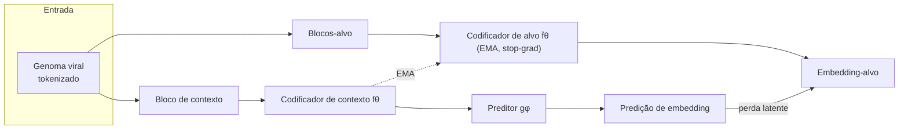
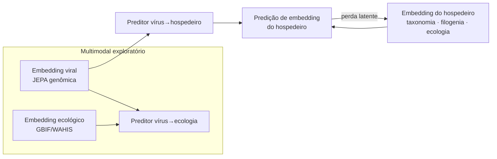

# Arquitetura técnica — JEPA-Spillover

Este documento descreve a arquitetura metodológica do projeto: a **JEPA genômica**, a **extensão
vírus-hospedeiro/multimodal**, o **fine-tuning supervisionado** e a estratégia de **avaliação**.

---

## 1. Princípio da JEPA

Uma *Joint Embedding Predictive Architecture* (JEPA) aprende prevendo a **representação latente** de
uma parte do dado a partir de outra parte, em vez de reconstruir o dado bruto (pixels, nucleotídeos).
Três componentes:

- **Codificador de contexto** ($f_\theta$): codifica a parte observada.
- **Codificador de alvo** ($f_{\bar\theta}$): codifica a parte a ser prevista. Atualizado por **EMA**
  (média móvel exponencial) dos pesos do contexto — não recebe gradiente direto.
- **Preditor** ($g_\phi$): prevê o embedding-alvo a partir do embedding de contexto.

A perda é calculada **no espaço latente** (ex.: erro quadrático/cosseno entre predição e alvo), o que
evita colapso trivial graças ao alvo via EMA + mascaramento por blocos.

---

## 2. JEPA genômica

### 2.1 Tokenização da sequência
O genoma viral (alfabeto `ACGTU`, ambíguos tratados na curadoria) é convertido em tokens por **k-mers
sobrepostos** (ou janelas de nucleotídeos). A sequência tokenizada é dividida em **blocos**.

### 2.2 Mascaramento por blocos (estilo I-JEPA)
- Um **bloco de contexto** contíguo (fração `context_block_frac` da sequência).
- Vários **blocos-alvo** (`num_target_blocks`) amostrados de outras regiões.
- O preditor recebe o embedding de contexto + a posição-alvo e prevê o embedding de cada bloco-alvo.

### 2.3 Codificador
Transformer (`embed_dim`, `depth`, `num_heads`) com *positional encoding*. Alternativa CNN 1D para
sequências longas/baixo custo. Configurável em `config/config.yaml → jepa.encoder`.

### 2.4 Objetivo
$$\mathcal{L}_{\text{JEPA}} = \frac{1}{M}\sum_{m=1}^{M} \big\| g_\phi(\hat z_{\text{ctx}}, p_m) - \text{sg}\big[f_{\bar\theta}(x_{t_m})\big] \big\|_2^2$$

onde `sg[·]` é *stop-gradient* e o codificador-alvo é atualizado por
$\bar\theta \leftarrow \tau\,\bar\theta + (1-\tau)\,\theta$.

---

## 3. Extensão vírus-hospedeiro e multimodal

Após o pré-treino genômico, o embedding viral vira **contexto** para prever o **embedding do
hospedeiro** associado (derivado de taxonomia/filogenia/ecologia do hospedeiro).

Resultado: um **espaço latente compartilhado** vírus · hospedeiro · ecologia, permitindo medir
**compatibilidade latente** (proximidade) entre um vírus e potenciais hospedeiros — incluindo humanos.

---

## 4. Fine-tuning supervisionado (risco de spillover)

Os embeddings JEPA (congelados ou parcialmente descongelados) alimentam uma **cabeça de classificação**
para estimar risco de spillover. Rótulos derivados de: histórico de infecção humana, amplitude de
hospedeiros, ocorrência de surtos e evidências de transmissão interespécies.

- **Validação cruzada** estratificada por família (`finetune.cv_folds`).
- **Validação entre famílias** (`holdout_families`): famílias inteiras ficam fora do treino e só
  aparecem no teste, simulando vírus emergentes/pouco caracterizados.

---

## 5. Baselines de comparação

| Baseline | Representação | Modelo |
|---|---|---|
| k-mer + classificador | Frequência de k-mers (`k=6`) | Regressão logística / Random Forest |
| LSTM supervisionado | Sequência tokenizada | LSTM + cabeça |
| Transformer supervisionado | Sequência tokenizada | Transformer treinado do zero com rótulos |
| **JEPA + cabeça** | Embeddings JEPA | Cabeça leve (foco do projeto) |

Métricas: **AUROC, AUPRC, F1, precisão, recall, especificidade, Brier** (calibração).

---

## 6. Avaliação de embeddings e interpretabilidade

- **Visualização:** UMAP/t-SNE colorido por família, hospedeiro e rótulo.
- **Clustering:** k-means/HDBSCAN + métricas de coesão/separação.
- **Vizinhança latente:** vírus pouco caracterizados próximos a zoonóticos conhecidos → **ranking de
  priorização** (score = densidade ponderada de vizinhos zoonóticos, ver `viz.knn_for_ranking`).
- **Ablação:** remover regiões genômicas / metadados de hospedeiro / variáveis ecológicas.
- **SHAP:** contribuição relativa de atributos nos classificadores finais.

---

## 7. Decisões de engenharia

- **Configuração única** (`config/config.yaml`) lida por todo o pipeline.
- **Reprodutibilidade:** seed global, ambiente declarado, *logging* via Trackio.
- **Escalabilidade:** FAISS para busca de vizinhos em grandes conjuntos de embeddings.
- **Progressividade:** núcleo = JEPA genômica; vírus-hospedeiro e multimodal são incrementais
  (exequibilidade em 12 meses).
