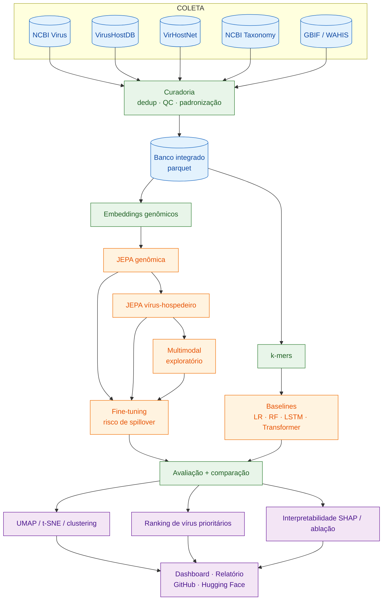

# Fluxograma 01 — Pipeline geral

```mermaid
flowchart TD
    classDef data fill:#e3f2fd,stroke:#1565c0,color:#0d47a1;
    classDef proc fill:#e8f5e9,stroke:#2e7d32,color:#1b5e20;
    classDef model fill:#fff3e0,stroke:#ef6c00,color:#e65100;
    classDef out fill:#f3e5f5,stroke:#6a1b9a,color:#4a148c;

    subgraph COLETA
        NCBI[(NCBI Virus)]:::data
        VHDB[(VirusHostDB)]:::data
        VHN[(VirHostNet)]:::data
        TAX[(NCBI Taxonomy)]:::data
        ECO[(GBIF / WAHIS)]:::data
    end

    NCBI & VHDB & VHN & TAX & ECO --> CUR[Curadoria<br/>dedup · QC · padronização]:::proc
    CUR --> DB[(Banco integrado<br/>parquet)]:::data

    DB --> KMER[k-mers]:::proc
    DB --> EMB[Embeddings genômicos]:::proc

    KMER --> BASE[Baselines<br/>LR · RF · LSTM · Transformer]:::model
    EMB --> JEPA[JEPA genômica]:::model
    JEPA --> VH[JEPA vírus-hospedeiro]:::model
    VH --> MM[Multimodal<br/>exploratório]:::model

    JEPA & VH & MM --> FT[Fine-tuning<br/>risco de spillover]:::model
    FT --> EVAL[Avaliação + comparação]:::proc
    BASE --> EVAL

    EVAL --> VIZ[UMAP / t-SNE / clustering]:::out
    EVAL --> RANK[Ranking de vírus prioritários]:::out
    EVAL --> SHAP[Interpretabilidade SHAP / ablação]:::out

    VIZ & RANK & SHAP --> PUB[Dashboard · Relatório<br/>GitHub · Hugging Face]:::out
```
