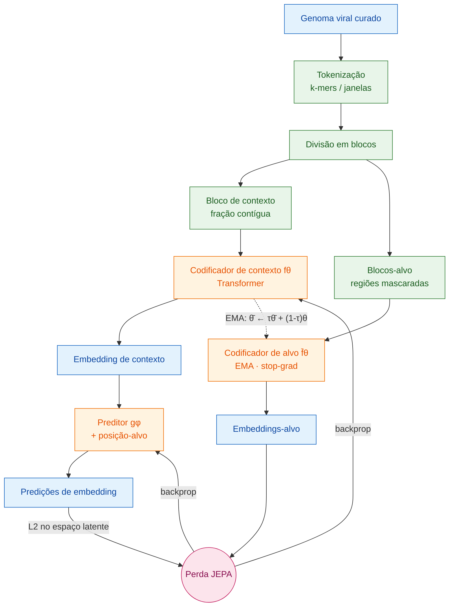
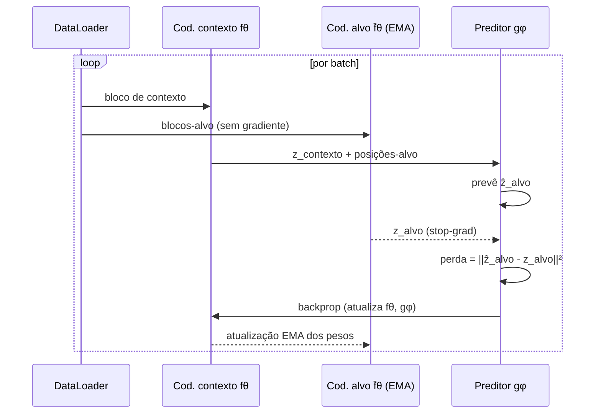

# Fluxograma 02 — JEPA genômica (detalhe)

```mermaid
flowchart TB
    SEQ[Genoma viral curado]:::data --> TOK[Tokenização<br/>k-mers / janelas]:::proc
    TOK --> BLK[Divisão em blocos]:::proc

    BLK --> CTXBLK[Bloco de contexto<br/>fração contígua]:::proc
    BLK --> TGTBLK[Blocos-alvo<br/>regiões mascaradas]:::proc

    CTXBLK --> FENC["Codificador de contexto fθ<br/>Transformer"]:::model
    TGTBLK --> TENC["Codificador de alvo f̄θ<br/>EMA · stop-grad"]:::model

    FENC --> ZC[Embedding de contexto]:::data
    TENC --> ZT[Embeddings-alvo]:::data

    ZC --> PRED["Preditor gφ<br/>+ posição-alvo"]:::model
    PRED --> ZHAT[Predições de embedding]:::data

    ZHAT -->|"L2 no espaço latente"| LOSS((Perda JEPA)):::out
    ZT --> LOSS

    LOSS -->|backprop| FENC
    LOSS -->|backprop| PRED
    FENC -. "EMA: θ̄ ← τθ̄ + (1-τ)θ" .-> TENC

    classDef data fill:#e3f2fd,stroke:#1565c0,color:#0d47a1;
    classDef proc fill:#e8f5e9,stroke:#2e7d32,color:#1b5e20;
    classDef model fill:#fff3e0,stroke:#ef6c00,color:#e65100;
    classDef out fill:#fce4ec,stroke:#c2185b,color:#880e4f;
```

## Sequência de treino (pseudo)

```mermaid
sequenceDiagram
    participant D as DataLoader
    participant C as Cod. contexto fθ
    participant T as Cod. alvo f̄θ (EMA)
    participant P as Preditor gφ
    loop por batch
        D->>C: bloco de contexto
        D->>T: blocos-alvo (sem gradiente)
        C->>P: z_contexto + posições-alvo
        P->>P: prevê ẑ_alvo
        T-->>P: z_alvo (stop-grad)
        P->>P: perda = ||ẑ_alvo - z_alvo||²
        P->>C: backprop (atualiza fθ, gφ)
        C-->>T: atualização EMA dos pesos
    end
```
