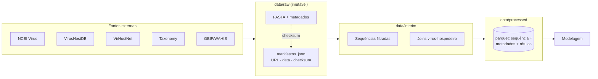
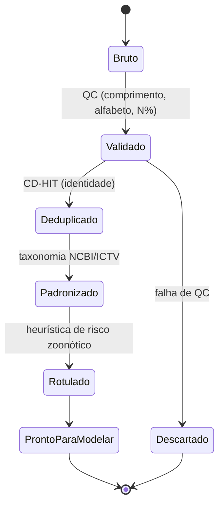
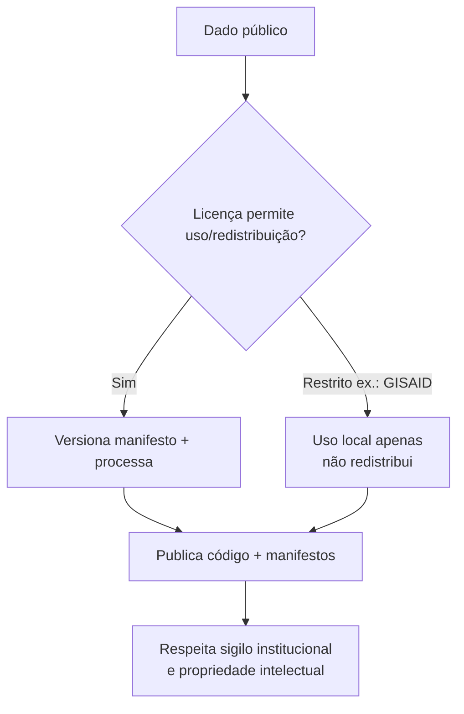

# Fluxograma 03 — Fluxo de dados e governança

```mermaid
flowchart LR
    subgraph EXTERNO[Fontes externas]
        S1[NCBI Virus]
        S2[VirusHostDB]
        S3[VirHostNet]
        S4[Taxonomy]
        S5[GBIF/WAHIS]
    end

    subgraph RAW["data/raw (imutável)"]
        R1[FASTA + metadados]
        RM[manifestos .json<br/>URL · data · checksum]
    end

    subgraph INTERIM["data/interim"]
        I1[Sequências filtradas]
        I2[Joins vírus-hospedeiro]
    end

    subgraph PROCESSED["data/processed"]
        P1[(parquet: sequência +<br/>metadados + rótulos)]
    end

    EXTERNO --> RAW
    RAW --> INTERIM
    INTERIM --> PROCESSED
    PROCESSED --> MODELO[Modelagem]

    R1 -.checksum.-> RM
```

## Estados de qualidade

```mermaid
stateDiagram-v2
    [*] --> Bruto
    Bruto --> Validado: QC (comprimento, alfabeto, N%)
    Validado --> Deduplicado: CD-HIT (identidade)
    Deduplicado --> Padronizado: taxonomia NCBI/ICTV
    Padronizado --> Rotulado: heurística de risco zoonótico
    Rotulado --> ProntoParaModelar
    ProntoParaModelar --> [*]
    Validado --> Descartado: falha de QC
    Descartado --> [*]
```

## Governança e ética

```mermaid
flowchart TD
    A[Dado público] --> B{Licença permite uso/redistribuição?}
    B -->|Sim| C[Versiona manifesto + processa]
    B -->|Restrito ex.: GISAID| D[Uso local apenas<br/>não redistribui]
    C --> E[Publica código + manifestos]
    D --> E
    E --> F[Respeita sigilo institucional<br/>e propriedade intelectual]
```
