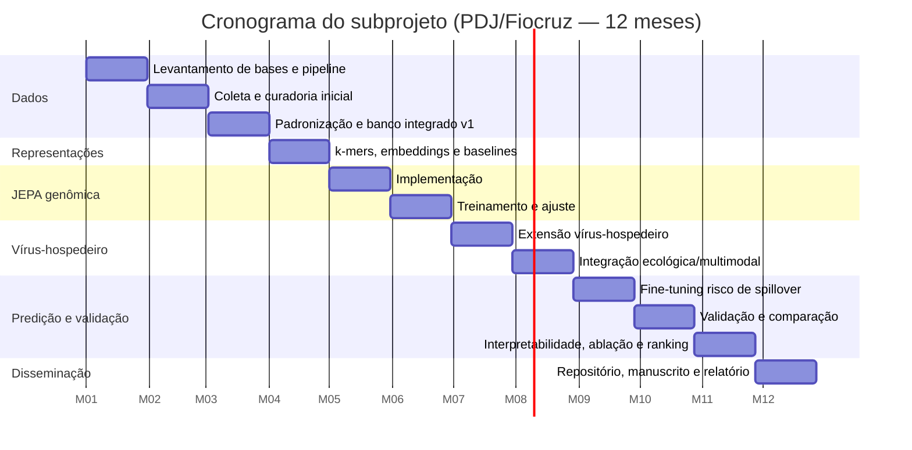

# Cronograma e roadmap — JEPA-Spillover (12 meses)

| Mês | Atividades principais | Produtos esperados | Meta |
|----:|---|---|:--:|
| 1 | Levantamento de bases, critérios de inclusão, desenho do pipeline | Plano técnico + lista de bases | 1 |
| 2 | Coleta e curadoria inicial de genomas e metadados | Base preliminar curada | 1 |
| 3 | Padronização taxonômica, dedup, estruturação | Banco integrado v1 | 1 |
| 4 | k-mers, embeddings genômicos, baselines | Matrizes de atributos + baselines | 2 |
| 5 | Implementação da JEPA genômica | Protótipo funcional | 3 |
| 6 | Treinamento e ajuste da JEPA genômica | Embeddings virais preliminares | 3 |
| 7 | Extensão vírus-hospedeiro | Modelo JEPA vírus-hospedeiro | 4 |
| 8 | Integração ecológica/interacional exploratória | Espaço latente multimodal preliminar | 4 |
| 9 | Fine-tuning supervisionado para risco | Modelo preditivo + métricas iniciais | 5 |
| 10 | Validação e comparação (LSTM/Transformer/k-mers) | Relatório comparativo | 5 |
| 11 | Interpretabilidade, ablação, UMAP/t-SNE, ranking | Figuras, rankings, interpretação | 5 |
| 12 | Repositório, manuscrito, relatório final | Manuscrito + repositório + relatório | 6 |

## Marcos (milestones)

- **M3** — Banco integrado v1 disponível e documentado.
- **M6** — JEPA genômica treinada com embeddings preliminares avaliados.
- **M9** — Primeiro modelo de risco de spillover com métricas.
- **M12** — Repositório público + manuscrito em preparação/submissão.

## Riscos e mitigação

| Risco | Mitigação |
|---|---|
| Rótulos escassos/enviesados | Núcleo auto-supervisionado; validação entre famílias |
| Dados ecológicos incompletos | Integração incremental; multimodal como exploratório |
| Custo computacional (Transformers) | Baseline k-mer/CNN; uso de GPU quando disponível; blocos menores |
| Vazamento de informação na avaliação | Particionamento estratificado + holdout de famílias inteiras |
